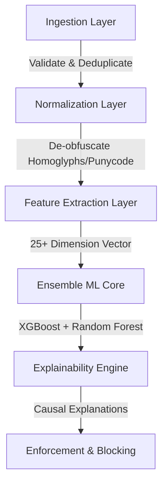

# 🛡️ VIGILANT

> **Real-Time AI/ML-Based Phishing Detection & Prevention System**

VIGILANT is an enterprise-grade, multi-layered threat detection system designed to identify and block phishing attempts across URLs, email content, and SMS messages in real-time. By combining high-speed de-obfuscation normalizers, advanced feature extraction, and ensemble machine learning models, VIGILANT delivers sub-50ms preliminary threat response coupled with deep async analysis.

---

## 📌 System Architecture

VIGILANT processes incoming threats through 6 discrete defense layers to ensure zero-day protection while keeping latencies minimal:



1. **Layer 1: Ingestion & Validation** — Receives scanned artifacts, extracts links from raw text, and computes SHA-256 hashes for de-duplication.
2. **Layer 2: Normalization & De-obfuscation** — Standardizes homoglyphs, decodes URL percent-encoding, translates Punycode, and performs async short URL expansions.
3. **Layer 3: Feature Extraction** — Converts normalized signals into a flat vector of structural, semantic, and domain-based attributes.
4. **Layer 4: Ensemble ML Detection** — Evaluates inputs using a weighted combo of **XGBoost** (URL Classifier) and **Random Forest** (NLP Classifier) models.
5. **Layer 5: Policy & Explainability** — Applies deterministic overrides (e.g., homoglyph floors) and maps predictions to human-readable security reasons.
6. **Layer 6: Real-Time Enforcement** — Saves the results to history and pushes blocking signals to the integrated Chrome extension.

---

## 🚀 Quick Start Guide

Follow these steps to spin up the entire VIGILANT protection system locally.

### 1. Start the FastAPI Backend
The backend runs the AI inference engine, database storage, and de-obfuscation logic.

```bash
# Navigate to the backend directory
cd backend

# Run the FastAPI server using Uvicorn
python -m uvicorn app.main:app --host 0.0.0.0 --port 8000 --reload
```
*Wait for the log: `[✓] VIGILANT is ready for threat detection`*

### 2. Launch the Analytics Dashboard
The dashboard provides a visual interface for live scans, history, and real-time security analytics.

```bash
# Navigate to the frontend directory
cd frontend

# Install dependencies if you haven't already
npm install

# Start the local development server
npm run dev
```
*Open http://localhost:5173 in your browser to access the dashboard.*

### 3. Install the Chrome Extension
Load the extension to get real-time blocking capabilities directly in your web browser:

1. Open Google Chrome and go to `chrome://extensions/`.
2. Enable **Developer Mode** using the toggle switch in the top right.
3. Click the **Load unpacked** button in the top left.
4. Select the `extension/` directory inside this project folder.
5. *Test it out:* Navigate to a test page (e.g., `http://paypa1-update.tk`) to see the AI extension block it instantly.

---

## 🧪 Demonstration & Testing

You can verify the performance of the system using the following test cases in the Dashboard Scanner:

### 🔹 URL Scanning (Homoglyph & Redirection Obfuscation)
* **Test Payload:** `http://paypa1-secure-login.bit.ly/update`
* **Features triggered:** Homoglyph replacement detection, suspicious TLD (`.bit.ly` / TLD-extract), brand impersonation metrics.

### 🔹 Email Analysis (Social Engineering & Coercion)
* **Test Payload:**
  > *"Urgent: Your account is suspended. Click here to verify your password immediately or your access will be permanently lost."*
* **Features triggered:** NLP urgency indicator, credential harvesting intent, brand spoofing.

### 🔹 SMS Analysis (Prize Scam / Callback Phishing)
* **Test Payload:**
  > *"Amazon: Unusual activity detected. Tap here to confirm your delivery address: http://amzon-track.tk"*
* **Features triggered:** SMS channel weights, TLD threat index, brand similarity.

---

## 🛠️ Tech Stack & Directory Structure

```
Vigilant/
├── backend/            # FastAPI Backend
│   ├── app/
│   │   ├── api/        # REST Route Controllers & Schemas
│   │   ├── core/       # Configurations (CORS, thresholds)
│   │   ├── db/         # SQLite DB Layer (aiosqlite)
│   │   ├── engine/     # 6-Layer Scanning & Policy Pipelines
│   │   ├── ml/         # XGBoost & Random Forest Classifiers
│   │   └── services/   # PhishTank Thread Intelligence Ingestion
│   └── requirements.txt
├── frontend/           # React + Vite UI Dashboard
│   ├── src/
│   │   ├── components/ # Reusable UI Elements (Shields, Tables)
│   │   ├── pages/      # Scanner, Live Analytics, History, About
│   │   └── index.css   # Tailored Styling & Tokens
│   └── package.json
├── extension/          # Manifest V3 Chrome Extension
│   ├── background.js   # Intercepts navigations (webNavigation)
│   ├── content.js      # Warning Overlay DOM injection
│   └── manifest.json
└── README.md
```

---

## 🛡️ License

This project is configured and maintained for security auditing and experimental zero-day phishing detection research.

